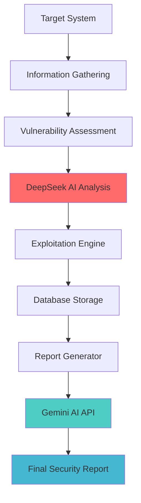

# 🛡️ CyberGuard PTaaS - Penetration Test as a Service

<div align="center">
  
</div>


## 🎯 Project Overview

**CyberGuard PTaaS** is an advanced **Penetration Testing as a Service** platform that delivers comprehensive security assessments for both **Web Applications** and **Network Infrastructure**. Our solution combines traditional penetration testing methodologies with cutting-edge AI analysis to provide accurate, actionable security insights.

🔐 **Mission:** Making enterprise-grade security testing accessible and automated  
🎯 **Target:** Web applications, network infrastructure, and cloud environments  
🚀 **Innovation:** AI-powered vulnerability analysis and risk assessment  
💡 **Vision:** Democratizing cybersecurity through intelligent automation  

---


## 🔄 Testing Methodology

Our platform follows a systematic **4-phase approach** that combines traditional penetration testing with AI-enhanced analysis:

### Phase 1: 🔍 Information Gathering
- **Network Discovery** → Port scanning, service enumeration
- **Web Reconnaissance** → Directory enumeration, technology stack identification
- **DNS Analysis** → Subdomain discovery, DNS record analysis
- **Social Engineering Intel** → Public information gathering

### Phase 2: 🔎 Vulnerability Assessment  
- **Automated Scanning** → CVE database matching
- **Configuration Analysis** → Security misconfigurations detection
- **Code Analysis** → Static and dynamic analysis for web apps
- **Network Weaknesses** → Protocol vulnerabilities, weak configurations

### Phase 3: 🤖 AI-Powered Analysis *(DeepSeek AI Model)*
Our **DeepSeek AI Model** processes data from phases 1 & 2 to provide:
- **🎯 Risk Score Calculation** → Intelligent risk prioritization
- **🔮 Expected Vulnerabilities** → Predictive vulnerability identification
- **📊 Attack Vector Analysis** → Comprehensive threat modeling
- **⚡ Remediation Recommendations** → Actionable security guidance

### Phase 4: 💥 Exploitation & Validation
- **CVE-Based Exploitation** → Real-world attack simulation
- **Expected Vulnerability Testing** → AI-predicted weakness validation
- **Proof of Concept** → Demonstrable security impact
- **False Positive Elimination** → Verified vulnerability confirmation

---


## 🏗️ System Architecture

<div align="center">
  


</div>

### 🔧 Core Components

**🚀 FastAPI Backend**
- High-performance API framework
- Asynchronous task processing
- RESTful endpoint architecture
- Real-time testing status updates

**🐳 Docker Containerization**
- Isolated testing environments
- Scalable service deployment
- Consistent cross-platform execution
- Resource optimization

**📊 MongoDB Database**
- Document-based result storage
- Efficient data filtering and processing
- Scalable vulnerability data management
- Real-time query performance

**🧠 AI Integration**
- **DeepSeek AI** → Vulnerability analysis & risk scoring
- **Gemini AI** → Comprehensive report generation
- Machine learning-based threat prediction
- Intelligent false positive reduction

---


## 🛠️ Tech Stack

### 🔐 Security Tools
<div align="center">
  


  
</div>

### 💻 Development Stack
<div align="center">
  
</div>

### 🤖 AI & APIs
<div align="center">
  


  
</div>

---


## 🚀 Key Features

### ⚡ **Automated Testing Pipeline**
- Seamless integration of multiple testing phases
- Parallel processing for faster results
- Real-time progress monitoring
- Automated report generation

### 🧠 **AI-Enhanced Analysis**
- **DeepSeek AI** provides intelligent vulnerability analysis
- Risk-based prioritization of security issues
- Predictive vulnerability identification
- **Gemini AI** generates comprehensive, professional reports

### 📊 **Comprehensive Reporting**
- Executive summary with risk metrics
- Technical vulnerability details
- Proof-of-concept demonstrations
- Actionable remediation guidelines

### 🔄 **Scalable Architecture**
- Docker-based microservices
- Horizontal scaling capabilities
- Load balancing for high availability
- Cloud-ready deployment options

### 🛡️ **Enterprise Security**
- Secure API authentication
- Encrypted data transmission
- Audit logging and compliance
- Role-based access control

---


## 📋 Installation & Setup

### Prerequisites
```bash
# Required software
- Docker & Docker Compose
- Python 3.9+
- MongoDB
- Git
```

### Quick Start
```bash
# Clone the repository
git clone https://github.com/mohammad-almohtaseb/cyberguard-ptaas.git
cd cyberguard-ptaas

# Setup environment variables
cp .env.example .env
# Edit .env with your API keys and configurations

# Build and run with Docker
docker-compose up -d

# Access the platform
# Web Interface: http://localhost:8000
# API Documentation: http://localhost:8000/docs
```

### Configuration
```yaml
# docker-compose.yml example
version: '3.8'
services:
  cyberguard-api:
    build: .
    ports:
      - "8000:8000"
    environment:
      - DEEPSEEK_API_KEY=${DEEPSEEK_API_KEY}
      - GEMINI_API_KEY=${GEMINI_API_KEY}
      - MONGODB_URL=${MONGODB_URL}
    depends_on:
      - mongodb
  
  mongodb:
    image: mongo:latest
    ports:
      - "27017:27017"
```

---


## 🔄 Usage Workflow

### 1. **Initialize Scan**
```python
# API Request Example
POST /api/v1/scan/start
{
  "target": "example.com",
  "scan_type": "comprehensive",
  "modules": ["web", "network"]
}
```

### 2. **Monitor Progress**
```python
# Real-time status updates
GET /api/v1/scan/{scan_id}/status
{
  "status": "running",
  "phase": "vulnerability_assessment",
  "progress": 65,
  "estimated_completion": "2024-01-15T10:30:00Z"
}
```

### 3. **AI Analysis Results**
```python
# DeepSeek AI Analysis Output
{
  "risk_score": 8.5,
  "critical_vulnerabilities": 3,
  "expected_vulnerabilities": [
    "SQL Injection in login form",
    "XSS in search functionality",
    "Open redirect vulnerability"
  ],
  "attack_vectors": ["web", "network"]
}
```

### 4. **Final Report**
```python
# Gemini-generated comprehensive report
GET /api/v1/scan/{scan_id}/report
# Returns detailed PDF/HTML security assessment
```

---


## 📊 Sample Output

### 🎯 Risk Assessment Dashboard
```
╔══════════════════════════════════════════════════════════════╗
║                    CYBERGUARD PTAAS RESULTS                 ║
╠══════════════════════════════════════════════════════════════╣
║ Target: example.com                                          ║
║ Scan Duration: 2h 34m                                        ║
║ Overall Risk Score: 8.5/10 (HIGH)                          ║
╠══════════════════════════════════════════════════════════════╣
║ VULNERABILITIES FOUND:                                       ║
║ • Critical: 3                                               ║
║ • High: 7                                                   ║
║ • Medium: 12                                                ║
║ • Low: 8                                                    ║
╠══════════════════════════════════════════════════════════════╣
║ AI PREDICTIONS VALIDATED: 85%                               ║
║ FALSE POSITIVES ELIMINATED: 23                              ║
╚══════════════════════════════════════════════════════════════╝
```

---


## 🎓 Research & Development

This project represents our **graduation thesis** from Philadelphia University's Cybersecurity program. Our research focuses on:

- **AI-Enhanced Penetration Testing** → Improving accuracy and efficiency
- **Automated Vulnerability Assessment** → Reducing manual testing overhead  
- **Cloud-Native Security Architecture** → Scalable security-as-a-service
- **Machine Learning in Cybersecurity** → Predictive threat modeling

### 📚 Academic Contributions
- Novel approach to AI-powered penetration testing
- Integration of multiple AI models for enhanced accuracy
- Comprehensive evaluation of automated vs manual testing
- Performance benchmarking against industry standards

---


## 🤝 Contributing

We welcome contributions from the cybersecurity community! Here's how you can help:

### 🔧 Development Areas
- **New Testing Modules** → Additional scanning capabilities
- **AI Model Integration** → Enhanced analysis algorithms  
- **Reporting Features** → Improved visualization and insights
- **Performance Optimization** → Faster scanning and processing

### 📝 Contribution Guidelines
1. Fork the repository
2. Create a feature branch (`git checkout -b feature/amazing-feature`)
3. Commit your changes (`git commit -m 'Add amazing feature'`)
4. Push to the branch (`git push origin feature/amazing-feature`)
5. Open a Pull Request

---


## 📄 License

This project is licensed under the **MIT License** - see the [LICENSE](LICENSE) file for details.

## ⚠️ Disclaimer

**CyberGuard PTaaS** is designed for **authorized security testing only**. Users are responsible for ensuring they have proper authorization before testing any systems. Unauthorized access to computer systems is illegal and unethical.

---


## 🌐 Connect With the Team

<div align="center">
  
[](https://linkedin.com/in/mohammad-al-mohtaseb-226134315)
[](mailto:mohammad.almohtaseb11@gmail.com)
[](https://github.com/mohammad-almohtaseb)
  
</div>

---


<div align="center">
  
  
  ### 🛡️ "Security is not a product, but a process. CyberGuard makes that process intelligent."
  
  
  
  
  
  **⭐ From [Mohammad Al-mohtaseb](https://github.com/mohammad-almohtaseb) with 🛡️**
</div>
