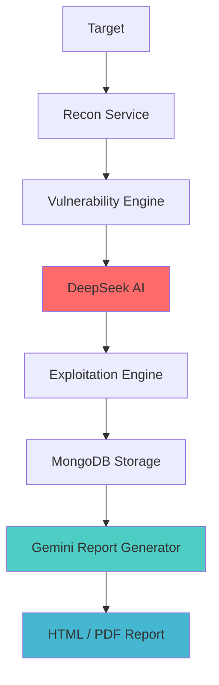

# 🛡️ CyberGuard PTaaS - Penetration Test as a Service

<div align="center">
  
</div>


## 🎯 Overview

**CyberGuard PTaaS** is a scalable and intelligent **Penetration Testing as a Service** solution designed to perform comprehensive testing on **Web Applications** and **Network Infrastructure**. This platform combines traditional security testing techniques with advanced AI-driven analysis.

* 🔐 **Mission:** Simplify enterprise-level penetration testing through automation
* 🎯 **Scope:** Web applications, internal/external networks, and cloud
* 🚀 **Edge:** AI-augmented vulnerability discovery and prioritization
* 💡 **Vision:** Make real-time, intelligent security testing available to all

---

## 🔄 Testing Pipeline

CyberGuard follows a robust **4-phase methodology**:

### Phase 1: 🔍 Reconnaissance

* Port & Service Enumeration (e.g., Nmap)
* Technology Stack Identification
* Subdomain & DNS Record Discovery
* Public Exposure & Metadata Collection

### Phase 2: 🔎 Vulnerability Assessment

* CVE Matching and Signature-based Scans
* Detection of Misconfigurations
* Static and Dynamic Code Analysis
* Weak Protocol & Service Identification

### Phase 3: 🤖 AI-Powered Analysis (DeepSeek AI)

* Contextual Risk Scoring
* Predictive Vulnerability Identification
* Attack Surface Modeling
* Tailored Remediation Insights

### Phase 4: 💥 Exploitation

* Controlled CVE Exploits
* Validate AI Predictions
* Proof-of-Concept Evidence
* Eliminate False Positives

---

## 🏗️ Architecture Diagram



---

## 🔧 Key Technologies

### Backend

* **FastAPI**: Async REST APIs, modular service endpoints
* **MongoDB**: JSON document store for collected and processed results
* **Docker**: Isolated service containers for scalable deployments

### Security Tools

* Nmap, OWASP ZAP, Burp Suite, Metasploit, WhatWeb

### AI Integrations

* **DeepSeek AI**: Predictive model for vulnerability insight
* **Gemini AI**: Report post-processing and executive formatting

---

## ⚙️ Setup & Deployment

### Prerequisites

```bash
- Python 3.9+
- Docker & Docker Compose
- Git
- MongoDB (optional local or cloud instance)
```

### Launch with Docker

```bash
git clone https://github.com/mohammad-almohtaseb/cyberguard-ptaas.git
cd cyberguard-ptaas
cp .env.example .env
# Edit .env with keys and DB configs
docker-compose up -d
```

### Sample docker-compose.yml

```yaml
version: '3.8'
services:
  cyberguard-api:
    build: .
    ports:
      - "8000:8000"
    environment:
      - DEEPSEEK_API_KEY=${DEEPSEEK_API_KEY}
      - GEMINI_API_KEY=${GEMINI_API_KEY}
      - MONGODB_URL=${MONGODB_URL}
    depends_on:
      - mongodb

  mongodb:
    image: mongo:latest
    ports:
      - "27017:27017"
```

---

## 🚀 Usage Example

### Start a Scan

```http
POST /api/v1/scan/start
{
  "target": "example.com",
  "scan_type": "comprehensive",
  "modules": ["web", "network"]
}
```

### Monitor Status

```http
GET /api/v1/scan/{scan_id}/status
```

### View AI Results

```json
{
  "risk_score": 8.5,
  "expected_vulnerabilities": [
    "SQL Injection",
    "Reflected XSS",
    "Open Redirect"
  ]
}
```

### Download Final Report

```http
GET /api/v1/scan/{scan_id}/report
# Returns PDF/HTML via Gemini AI
```

---

## 📊 Sample Risk Report

```
Target: example.com
Risk Score: 8.5/10 (High)
Duration: 2h 34m
Vulnerabilities:
  - Critical: 3
  - High: 7
  - Medium: 12
  - Low: 8
AI Accuracy: 85%
False Positives Removed: 23
```

---

## 🎓 Academic Research

* Developed as a graduation project at Philadelphia University
* Combines CVE analysis, AI-based prediction, and real-world exploit testing
* Benchmarked against OWASP Top 10 & industry tools

---

## 🤝 Contribute

### We welcome:

* New scanning modules
* Report templates or visualization tools
* AI enhancements (risk scoring, classification)

### To contribute:

```bash
git clone https://github.com/mohammad-almohtaseb/cyberguard-ptaas.git
```

Follow standard PR process.

---

## 📄 License

This project is licensed under the **MIT License**.

## ⚠️ Legal Notice

Use **CyberGuard PTaaS** only on systems you are authorized to test.
Unauthorized scanning is illegal and unethical.

---

## 🌐 Contact

<div align="center">

[](https://linkedin.com/in/mohammad-al-mohtaseb-226134315)
[](mailto:mohammad.almohtaseb11@gmail.com)
[](https://github.com/mohammad-almohtaseb)

</div>

---

<div align="center">
  

### 🛡️ "Security is not a product, but a process. CyberGuard makes that process intelligent."

</div>
