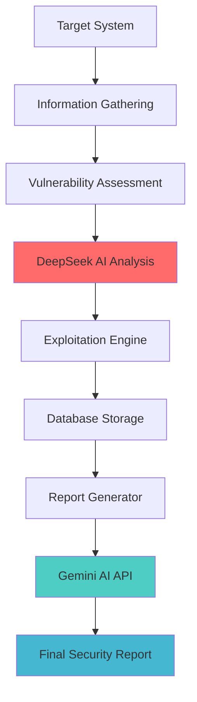

# 🛡️ CyberGuard PTaaS - Penetration Test as a Service

  

## 🎯 Project Summary

**CyberGuard PTaaS** is a comprehensive Penetration Testing as a Service platform designed to assess both Web and Network targets. It operates through a fully automated, multi-phase testing pipeline integrated with advanced AI models for intelligent analysis and reporting.

---

## 🧪 Testing Lifecycle

CyberGuard operates in **5 key phases**:

### 1️⃣ Information Gathering
* Network discovery, port scanning
* Web reconnaissance & DNS analysis

### 2️⃣ Vulnerability Assessment
* Automated vulnerability scanning (CVE-based)
* Static and dynamic analysis

### 3️⃣ AI Analysis via **DeepSeek AI**
* 📊 Generates a **Risk Score**
* 🔍 Predicts **Expected Vulnerabilities** based on the collected data

### 4️⃣ Exploitation
* CVE-based exploitation
* Validating expected vulnerabilities
* Eliminating false positives with real PoC

### 5️⃣ Gemini AI Report Generation
* Comprehensive security assessment report via API
* Professional documentation with actionable recommendations

---

## 🤖 AI Integration

* **DeepSeek AI** → Risk scoring and vulnerability prediction
* **Gemini AI** → Generates a detailed **Security Assessment Report** via API

📁 All results are stored in a structured MongoDB document format per phase, pre-processed and filtered before report generation.

---

## ⚙️ Architecture Overview

🔗 [GitHub - mohammad-almohtaseb/cyber_guard](https://github.com/mohammad-almohtaseb/cyber_guard)

---

## 👥 Team & Contact

  

  

---

  
  
  ### 🛡️ "Security is not a product, but a process. CyberGuard makes that process intelligent."
  
  
  
  
  
  **⭐ From [Mohammad Al-mohtaseb](https://github.com/mohammad-almohtaseb) with 🛡️**

